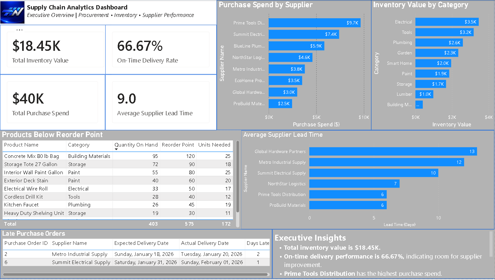
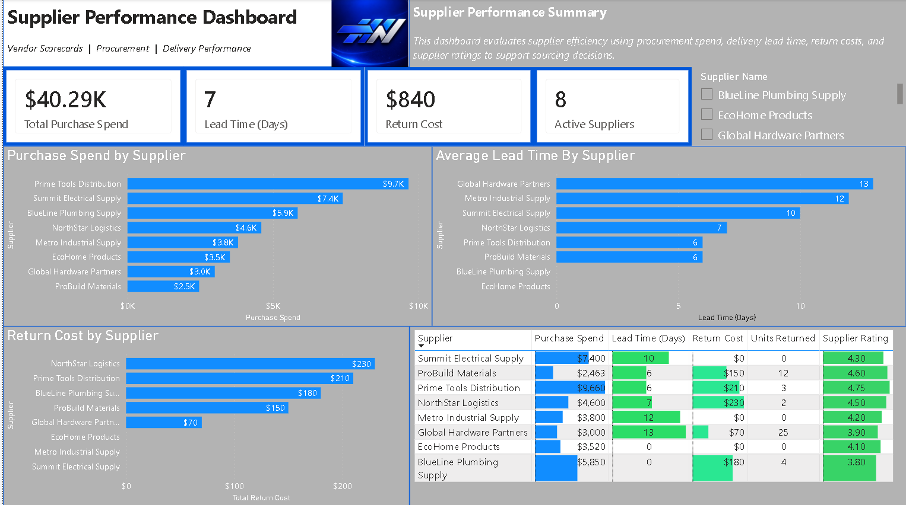
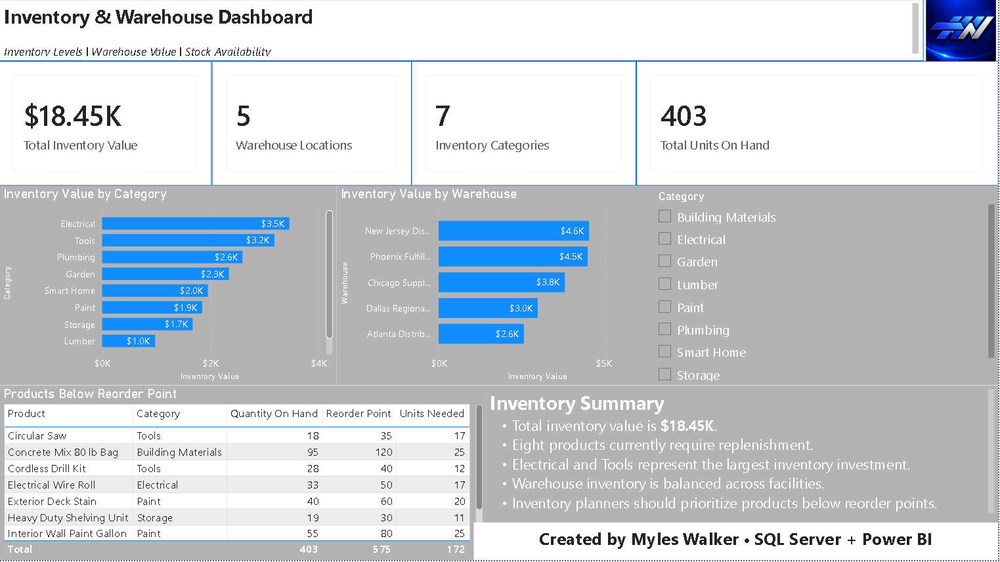

# Supply Chain Analytics Dashboard

An end-to-end supply chain analytics solution developed using SQL Server and Power BI. The project analyzes procurement spending, supplier performance, inventory health, warehouse distribution, delivery reliability, and replenishment requirements.

## Project Overview

Supply chain leaders need clear visibility into supplier reliability, inventory value, purchasing activity, warehouse performance, and products requiring replenishment.

This project converts fictional operational data into an interactive three-page Power BI report designed to support procurement and inventory decisions.

## Tools Used

- SQL Server
- SQL Server Management Studio
- Power BI Desktop
- DAX
- GitHub

## Dashboard Pages

### Executive Overview

Provides a high-level view of:

- Total inventory value
- Total purchase spend
- On-time delivery rate
- Average supplier lead time
- Purchase spending by supplier
- Products below reorder point
- Late purchase orders



### Supplier Performance

Evaluates suppliers using:

- Purchase spend
- Average lead time
- Return cost
- Units returned
- Supplier ratings
- Active supplier count



### Inventory and Warehouse Performance

Analyzes:

- Inventory value by category
- Inventory value by warehouse
- Total units on hand
- Warehouse locations
- Inventory categories
- Products below reorder point



## Database Structure

The SQL Server database includes the following tables:

- Suppliers
- Products
- Warehouses
- PurchaseOrders
- PurchaseOrderItems
- Inventory
- Shipments
- Returns

## Key SQL Features

- Relational database design
- Primary and foreign keys
- Multi-table joins
- Aggregate functions
- CASE expressions
- Date calculations
- Reporting views
- Supplier scorecard view

## Key Business Insights

- Total inventory value is approximately $18.45K.
- The on-time delivery rate is 66.67%, indicating an opportunity to improve supplier reliability.
- Prime Tools Distribution represents the highest procurement spend.
- Global Hardware Partners has the longest average supplier lead time.
- Electrical and Tools represent the largest inventory investments.
- Multiple products are below their reorder points and should be prioritized for replenishment.

## Repository Structure

```text
SQL/          SQL database, sample data, queries, and views
PowerBI/      Power BI report file
Screenshots/  Dashboard images
Assets/       MWFW Solutions branding
